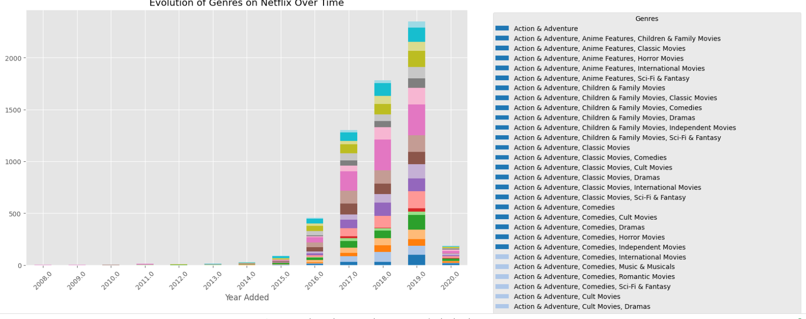
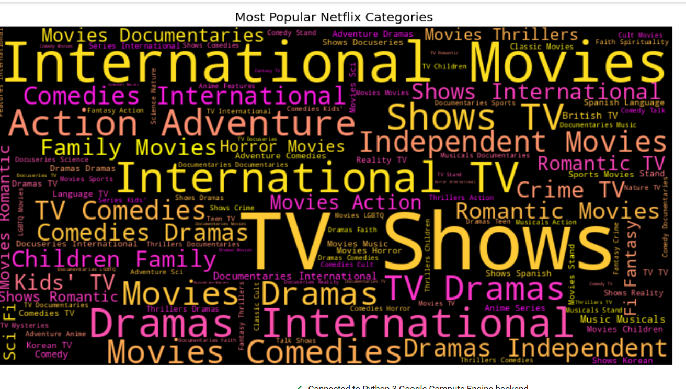

# 📺 Streamlytics: The Data Behind the Binge  

> *What if Netflix’s massive content library could spill its secrets?*  

🔍 **Welcome to Streamlytics**—where I take **7,000+ Netflix titles**, clean them up, visualize the trends, and serve a **hot plate of insights** with **Python**. This is more than EDA—it's **storytelling through data.**  

📊 **From binge-worthy genres to country-wise streaming trends,** let's uncover the analytics behind what makes Netflix, well... Netflix!  

---

## 📌 Sneak Peek: Insights at a Glance  

### 🎭 **Top Genres Over Time**  
  

### 🔥 **Most Popular Content Categories**  
  

---

## ⚡️ Why This Project?  

✅ **Real-world dataset** with 7,000+ Netflix shows & movies  
✅ **Data cleaning & preprocessing** with **Pandas**  
✅ **Trendy visualizations** using **Seaborn & Matplotlib**  
✅ **Uncover hidden insights** into streaming trends  

---

## 🚀 Installation & Usage  

1️⃣ **Clone the repo**  
```bash
git clone https://github.com/Damamsneha/streamlytics-netflix.git
```  

2️⃣ **Install dependencies**  
```bash
pip install -r requirements.txt
```  

3️⃣ **Open & Run the Notebook**  
```bash
jupyter notebook netflix-eda.ipynb
```  

---

## 📂 Project Structure  
```bash
📦 streamlytics-netflix  
 ┣ 📂 charts/              # Visualizations & Graphs  
 ┣ 📜 netflix-eda.ipynb    # Jupyter Notebook with analysis  
 ┣ 📜 requirements.txt     # Install dependencies  
 ┗ 📜 README.md            # This file!  
```  

---

## 💡 Key Findings  

🔹 **Drama & Comedy Dominate**: The two biggest genres over the years  
🔹 **Netflix Originals on the Rise**: More in-house content in the past 5 years  
🔹 **Country Trends**: US & India lead in total Netflix content  

---

## 🔗 Links & Resources  

📌 **GitHub Repo** → [Streamlytics-Netflix](https://github.com/Damamsneha/streamlytics-netflix)  
📌 **Dataset Source** → [Netflix Titles Dataset](https://www.kaggle.com/datasets/shivamb/netflix-shows)  
📌 **Connect on LinkedIn** → [Your LinkedIn Profile](https://www.linkedin.com/in/damam-sneha/)  

---

## 📣 Let's Connect!  

If you find this useful, **drop a ⭐️ on GitHub** & let’s connect on **[LinkedIn](https://www.linkedin.com/in/damam-sneha/)!** 

🚀 **Stay tuned for more data-driven projects!**  


“Without data, you're just another person with an opinion.” – W. Edwards Deming
